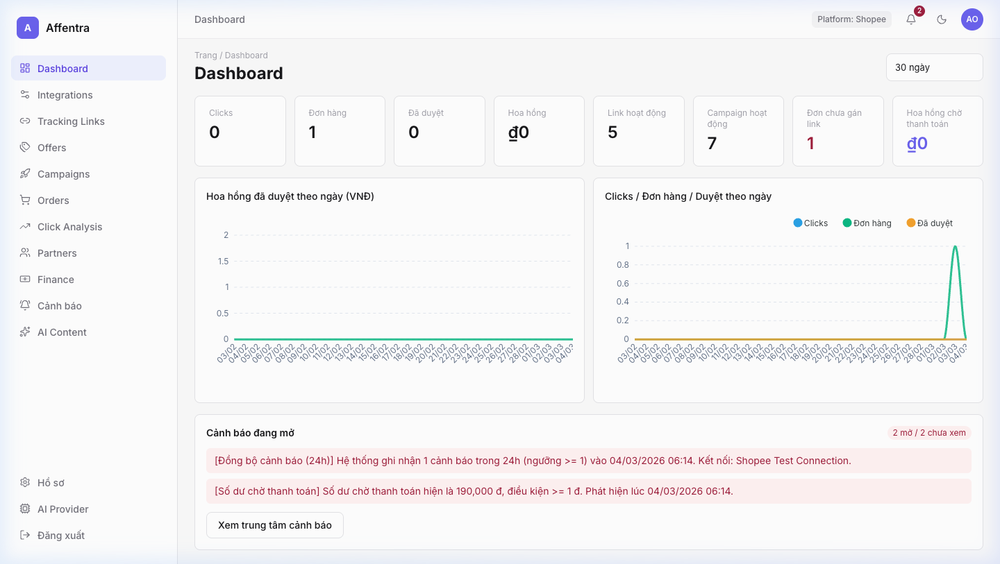
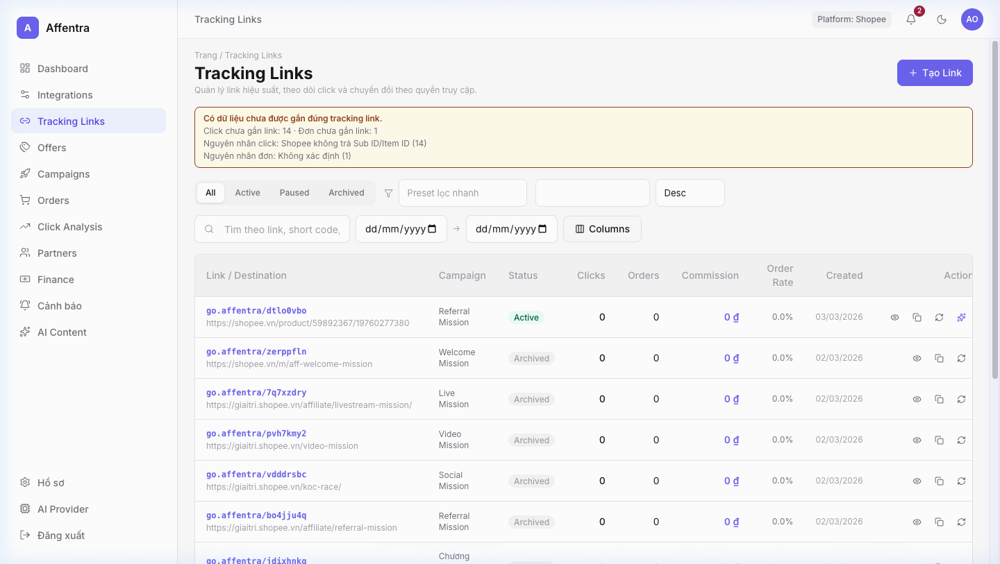
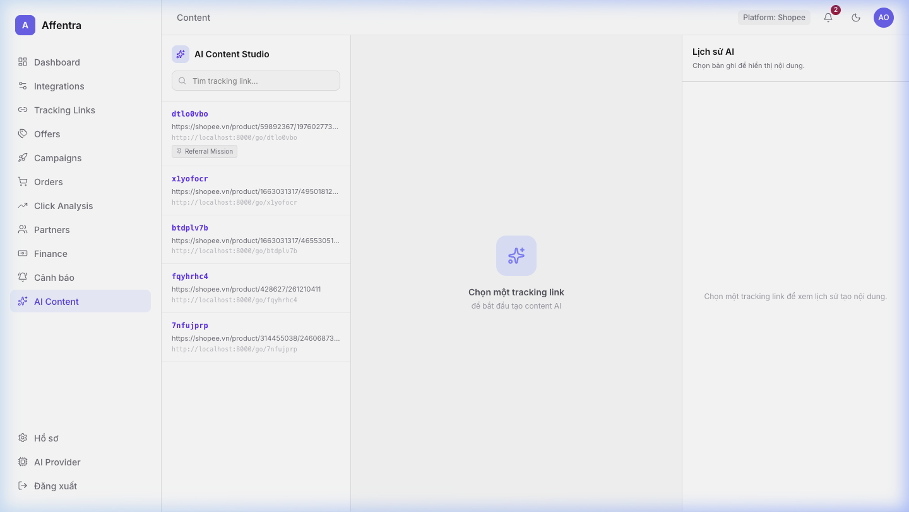
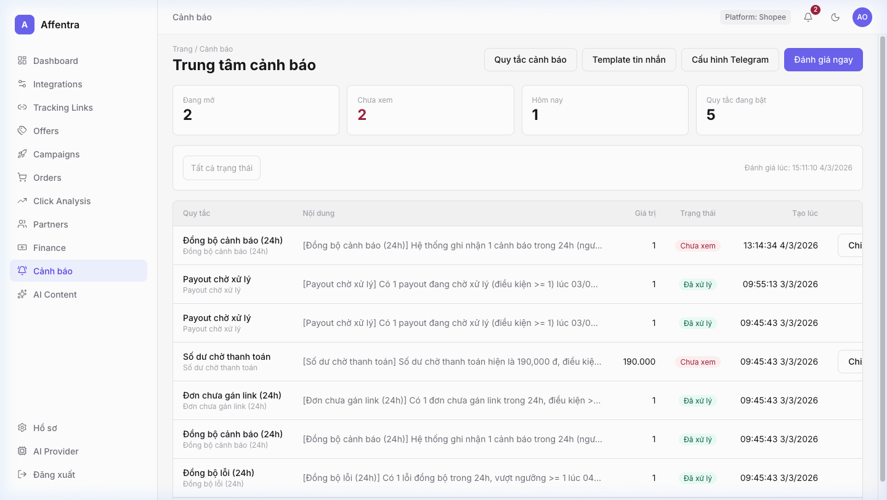
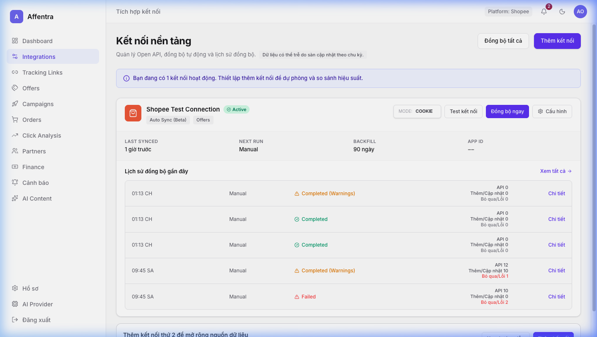
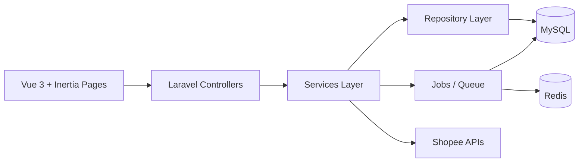

# Affentra Affiliate Admin

Hệ thống quản trị Affiliate tập trung cho team vận hành (Owner/Leader/Partner), tối ưu cho:
- Quản lý tracking link và attribution
- Đồng bộ dữ liệu từ nền tảng (Shopee)
- Theo dõi click, đơn hàng, hoa hồng, payout
- Quản trị cảnh báo hệ thống + Telegram per-user
- Hỗ trợ AI Content Studio cho chiến dịch

## Screenshots

| Dashboard | Tracking Links |
|---|---|
|  |  |

| AI Content Studio | Alert Center |
|---|---|
|  |  |

| Integrations |
|---|
|  |


## 1) Phạm vi hiện tại

### Platform support
- Production-ready: `Shopee`
- Multi-platform ready (kiến trúc mở rộng): `Lazada`, `TikTok` (chưa có adapter sync chính thức)

### Connection methods
- `open_api`: dùng Open API (full discovery cho Offers)
- `cookie`: dùng cURL profile/cookie (item lookup ổn định cho Offers + sync API portal)
- `portal_export`: import file portal (không dùng cho discovery ở màn Offers)

## 2) Kiến trúc hệ thống

Hệ thống đi theo service-oriented architecture trong Laravel:



### Layering chính
- `app/Http/Controllers`: điều phối request/response, không chứa business logic nặng
- `app/Services`: business rules, orchestration, validation theo domain
- `app/Repositories/Eloquent`: query/pagination/aggregate
- `app/Jobs`: sync, aggregate, background tasks
- `app/Models`: entity + cast + relation

### Security & hardening đã áp dụng
- Session auth + CSRF cho `/api/*` (qua `web` middleware)
- Correlation Request ID (`X-Request-ID`)
- Security headers + CSP config-driven
- Trusted Host protection
- Audit logging cho action quan trọng
- Redaction dữ liệu nhạy cảm trong audit
- **Authorization Policies** cho Orders, AlertRules, PayoutBatches, PlatformConnections (IDOR prevention)
- **Scraper SSRF hardening**: domain allowlist (Shopee/Lazada/TikTok) + HTTPS-only + private IP CIDR blocklist
- **Image upload hardening**: MIME validation + `getimagesize()` signature check + private disk storage
- **Payout finalize locking**: `lockForUpdate()` trên cả batch row và sub-items để đảm bảo tổng chính xác

## 3) Công nghệ sử dụng

### Backend
- PHP `^8.4`
- Laravel `^12`
- Inertia Laravel `^2`
- Repository pattern (`prettus/l5-repository`)
- Redis (`predis/predis`) cho queue/cache/lock

### Frontend
- Vue 3 + Inertia.js
- Vite + Tailwind CSS v4
- ApexCharts, flatpickr, tom-select

### Infra local
- Docker Compose: `app`, `web (nginx)`, `mysql`, `redis`, `worker-sync`, `scheduler`, `mailpit`

## 4) Module chức năng

### 4.1 Auth & Profile
- Login/Register/Forgot/Reset password
- Google OAuth login
- Profile + payout profile update

### 4.2 Dashboard
- KPI click/order/commission
- Summary API theo scope role
- Cache và global filters

### 4.3 Tracking Links
- CRUD, archive, detail
- Refresh product info
- Attribution metadata

### 4.4 Campaigns
- List + global stats
- Sync campaign từ Shopee
- Deep-link sang Tracking Links

### 4.5 Orders & Commissions
- Filter theo trạng thái/sàn/kỳ/search
- CSV import (queue-based)
- Mapping attribution từ sub_id/product

### 4.6 Click Analytics
- Overview / Click report / Conversion report
- Aggregate daily stats (scheduled)
- Export endpoint

### 4.7 Integrations
- Quản lý connection (open_api/cookie/portal_export)
- Test connection, sync manual, sync history
- Scheduled sync dispatch

### 4.8 Offers
- Search offers (theo mode connection)
- Offer detail
- Get tracking link từ offer
- Cookie mode: item lookup (item_id/URL Shopee)

### 4.9 Finance & Payout
- Billing/payout summary
- Sync payment data
- Payout batches + finalize (với `lockForUpdate` đảm bảo totals chính xác)
- Payout approval API (state machine: Pending → Approved/Rejected)
- **FormRequest validation** cho mọi input tài chính

### 4.10 Alerts
- Rule-based alert center (Policy-protected per-user)
- Incident lifecycle (seen/resolve/comment)
- Template system (In-app + Telegram)
- Telegram config theo từng user (không dùng global env runtime)

### 4.11 AI Content
- Content Studio cho tracking link
- History/statistics/generation status
- AI provider settings per-user

## 5) Luồng đồng bộ dữ liệu (Sync lifecycle)

### Cơ chế chung
- Manual sync: người dùng bấm `Sync Now`
- Scheduled sync: job `DispatchScheduledSyncsJob` quét connection `sync_mode=scheduled`
- Mutex lock per connection để chống chạy chồng job

### Cửa sổ đồng bộ
- Lần đầu (chưa có `last_sync_at`): backfill theo `SHOPEE_BACKFILL_DAYS`
- Các lần sau: incremental sync với overlap `SYNC_INCREMENTAL_OVERLAP_HOURS`
- Có hard limit bởi `SHOPEE_HARD_LIMIT_DAYS`

### Trạng thái sync quan trọng
- `completed`
- `completed_with_warnings`
- `failed_auth` / `failed_api` / `failed_validation`
- `rate_limited`
- `skipped_locked` / `skipped_disabled`

## 6) Cài đặt nhanh (Docker)

### 6.1 Prerequisites
- Docker + Docker Compose
- Node.js 20+ (để chạy Vite trên host nếu cần)

### 6.2 Setup
```bash
cp .env.example .env
docker compose up -d --build
docker compose exec app composer install
docker compose exec app php artisan key:generate
docker compose exec app php artisan migrate --force
docker compose exec app php artisan db:seed --force
npm install
npm run dev
```

`worker-sync` và `scheduler` đã được khai báo trong `docker-compose.yml` và chạy nền cùng stack.

### Truy cập
- App: [http://localhost:8000](http://localhost:8000)
- Mailpit: [http://localhost:8025](http://localhost:8025)

### Tài khoản seed mặc định
- Email: giá trị `SEED_ADMIN_EMAIL` trong `.env` (default `admin@affentra.com`)
- Password: `SEED_ADMIN_PASSWORD` (default `password`)

## 7) Chạy local không Docker

Yêu cầu có sẵn MySQL + Redis cục bộ.

```bash
cp .env.example .env
composer install
php artisan key:generate
php artisan migrate
php artisan db:seed
npm install
```

Chạy các tiến trình:
```bash
php artisan serve
php artisan queue:work --sleep=1 --tries=3 --timeout=120 --memory=256 --no-interaction
php artisan schedule:work
npm run dev
```

Hoặc dùng script:
```bash
composer run dev
```

## 8) Biến môi trường quan trọng

### Core
- `APP_URL`, `APP_ENV`, `APP_DEBUG`
- `DB_*`, `REDIS_*`, `QUEUE_CONNECTION`, `CACHE_STORE`

### Integration / Sync
- `INTEGRATIONS_ENABLE_COOKIE_METHOD`
- `SHOPEE_AFFILIATE_API_URL`
- `SHOPEE_SYNC_MODE`
- `SHOPEE_BACKFILL_DAYS`
- `SHOPEE_HARD_LIMIT_DAYS`
- `SHOPEE_OFFER_CACHE_TTL`
- `SHOPEE_CAMPAIGN_SYNC_AT`
- `SYNC_INTERVAL_MINUTES`
- `SYNC_INCREMENTAL_OVERLAP_HOURS`
- `SYNC_LOCK_TTL`
- `SYNC_UPSERT_CHUNK`

### Security
- `SECURITY_CSP_ENABLED`
- `SECURITY_CSP_REPORT_ONLY`
- `SECURITY_CSP_DEV_ORIGINS`
- `SECURITY_HSTS_*`

### Alerts
- `ALERT_EVALUATION_INTERVAL_MINUTES`
- `ALERT_TELEGRAM_BOT_TOKEN` / `ALERT_TELEGRAM_CHAT_ID`: deprecated (giữ comment, không dùng runtime)

## 9) API map (high-level)

### Web pages
- `/dashboard`, `/links`, `/campaigns`, `/orders`, `/partners`, `/integrations`, `/offers`, `/finance`, `/alerts`, `/ai/content`, `/settings/ai`, `/profile`

### API groups (`/api/*`)
- `dashboard/*`
- `links/*`
- `campaigns/*`
- `orders/*`
- `partners/*`
- `integrations/*`
- `offers/*`
- `analytics/clicks/*`
- `alerts/*`
- `finance/*`, `payout-batches/*`, `payout-approvals/*`
- `links/{trackingLink}/content/*`, `content-generations/*`, `ai/settings/*`
- `tools/scrape-product` (SSRF-hardened, throttle 10/min)
- `images/upload` (private disk, signature check, throttle 20/min)
- `ai/images/{filename}` (serve private upload với `Content-Disposition: inline`)

## 10) Testing & quality

Chạy test suite:
```bash
php artisan test
```

Chạy nhóm test cụ thể:
```bash
# Security tests
php artisan test tests/Feature/Tools/ScraperSecurityTest.php
php artisan test tests/Feature/Tools/ImageUploadSecurityTest.php

# Finance tests
php artisan test tests/Feature/Finance/PayoutBatchTest.php
php artisan test tests/Feature/PayoutApprovalTest.php

# Authorization
php artisan test tests/Feature/TrackingLinkAuthorizationTest.php
```

Build frontend production:
```bash
npm run build
```

Kiểm tra failed jobs:
```bash
php artisan queue:failed
```

## 11) Troubleshooting

### 11.1 CSP chặn Vite/font khi chạy local
- Đảm bảo `.env` có:
  - `SECURITY_CSP_ENABLED=true`
  - `SECURITY_CSP_REPORT_ONLY=false` (hoặc true để quan sát)
  - `SECURITY_CSP_DEV_ORIGINS=http://localhost:5173,http://127.0.0.1:5173`
- Vite URL mặc định: `http://[::1]:5173`

### 11.2 Shopee anti-bot `90309999`
- Đây là soft-block từ Shopee endpoint cookie mode
- Cập nhật lại cURL profile đúng endpoint (dashboard/report/click/campaign/offer product)
- Test connection sẽ báo usable nếu còn endpoint pass hoặc soft-block có thể recover

### 11.3 Đồng bộ không chạy
- Kiểm tra `worker-sync` + `scheduler` container đang up
- Kiểm tra lock key Redis nếu nghi stuck
- Kiểm tra bảng `sync_runs` và `platform_connections.last_sync_status`

### 11.4 Offers không ra dữ liệu (cookie mode)
- Cookie mode chỉ hỗ trợ item lookup
- Input phải là `item_id` hoặc URL Shopee parse được item
- `connection_id` là bắt buộc (không auto pick)

## 12) Cấu trúc thư mục

```text
app/
  Http/
    Controllers/
    Middleware/
  Jobs/
  Models/
  Repositories/Eloquent/
  Services/
config/
database/
docs/
  architecture/
  design/
  runbooks/
resources/js/
  Pages/
routes/
```

## 13) Tài liệu liên quan
- Kiến trúc & contract: `docs/architecture/01-audit-contracts-and-plan.md`
- Runbook sync click: `docs/runbooks/click-sync-v5.md`
- UI checklist: `docs/design/phase2-ui-design-checklist.md`

## 14) Ghi chú roadmap
- Multi-platform adapters (Lazada/TikTok)
- Nâng cấp observability và báo cáo hiệu năng truy vấn
- Mở rộng automation và rules engine cho alert/payout

---
